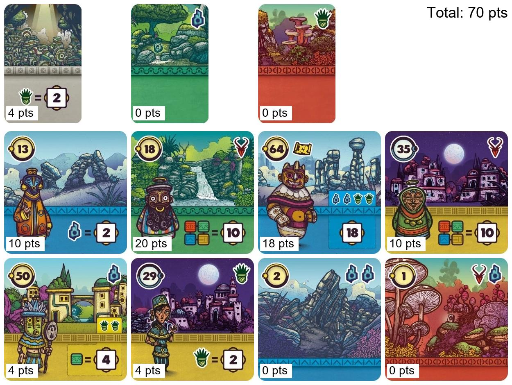

# 🎴 Faraway Analyze

> Moteur d'analyse et d'IA pour le jeu de cartes **FARAWAY** — simulation, stratégie et apprentissage automatique.


---

## 🃏 C'est quoi FARAWAY ?

FARAWAY est un jeu de cartes stratégique où chaque joueur construit un parcours de 8 régions et accumule des points via des conditions de scoring spécifiques à chaque carte. Ce projet vise à **modéliser le jeu**, **simuler des parties** et **entraîner des agents IA** capables de jouer de manière optimale.



---

## ✨ Fonctionnalités

- 🎮 **Moteur de jeu complet** — règles, ordre de jeu, sanctuaires, pioche, scoring
- 🤖 **Plusieurs agents IA** avec des niveaux de complexité croissants
- 📊 **Simulation de masse** — lancer N parties et comparer les stratégies
- 🧠 **Apprentissage par renforcement** — Q-learning et agent autonome
- 🖼️ **Visualisation** — génération d'images JPG récapitulatives des parties

---

## 🤖 Les agents disponibles

| Agent | Stratégie |
|---|---|
| `RandomAgent` | Joue aléatoirement — sert de baseline |
| `GreedyAgent` | Maximise le score immédiat à chaque tour |
| `ProbabilisticAgent` | Prend en compte les probabilités des cartes restantes |
| `LookaheadAgent` | Explore en profondeur (minimax / simulation) |
| `LearningLookaheadAgent` | Lookahead + Q-learning entre les parties |
| `AutonomousAgent` | Apprend seul par renforcement, sans règles injectées |
| `ExplorationAgent` | Favorise l'exploration pour diversifier les stratégies |
| `DecisionTreeAgent` | Prise de décision basée sur un arbre de décision |

---

## 🚀 Installation

```bash
git clone https://github.com/faltawer/Faraway_analyze.git
cd Faraway_analyze
pip install -r requirements.txt
```

---

## 🎮 Utilisation

### Lancer une partie simple
```python
from ai.agents import GreedyAgent, RandomAgent
from main import run_game

agents = [
    GreedyAgent("Alice"),
    RandomAgent("Bob"),
    RandomAgent("Charlie"),
]
run_game(agents, card_file="./Documentation/faraway_data.xlsx")
```

### Simuler N parties et comparer les agents
```python
run_simulations(n=1000, card_file="./Documentation/faraway_data.xlsx")
```

### Entraîner un agent autonome par self-play
```python
run_autonomous_training(
    n=100000,
    card_file="./Documentation/faraway_data.xlsx",
    save_path="autonomous.pkl"
)
```

### Trouver le score théorique maximum
```python
find_theoretical_max(card_file="./Documentation/faraway_data.xlsx", n=10000)
```

---

## 📁 Structure du projet

```
Faraway_analyze/
├── main.py                  # Point d'entrée principal
├── models/
│   ├── card.py              # Modèle de carte
│   ├── player.py            # Modèle de joueur
│   ├── game_state.py        # État du jeu
│   └── loader.py            # Chargement des cartes depuis Excel
├── engine/
│   ├── rules.py             # Règles du jeu (ordre, sanctuaires, pioche)
│   └── scorer.py            # Calcul des scores
├── ai/
│   ├── base_agent.py        # Classe abstraite Agent
│   └── agents/              # Tous les agents IA
├── ui/
│   └── display.py           # Génération d'images de résultats
├── Documentation/
│   ├── faraway_data.xlsx    # Données des cartes
│   └── Output/              # Images générées
└── Test/                    # Tests unitaires
```

---

## 📊 Exemple de résultats (1000 simulations)

```
=== Résultats sur 1000 simulations ===
 Random_1      : score moyen= 28.4 | victoires= 87/1000 (9%)
 Random_2      : score moyen= 28.1 | victoires= 91/1000 (9%)
 Greedy_1      : score moyen= 41.3 | victoires=412/1000 (41%)
 Greedy_2      : score moyen= 41.0 | victoires=410/1000 (41%)
```

---

## 🗺️ Roadmap

- [x] Moteur de jeu complet
- [x] Agents Random, Greedy, Probabiliste
- [x] Lookahead + simulation Monte Carlo
- [x] Q-learning et agent autonome
- [x] Visualisation des parties
- [ ] Interface graphique (Tkinter ou web)
- [ ] Export des statistiques en dashboard
- [ ] Support multijoueur en réseau

---

## 📄 Licence

MIT — libre d'utilisation, de modification et de partage.